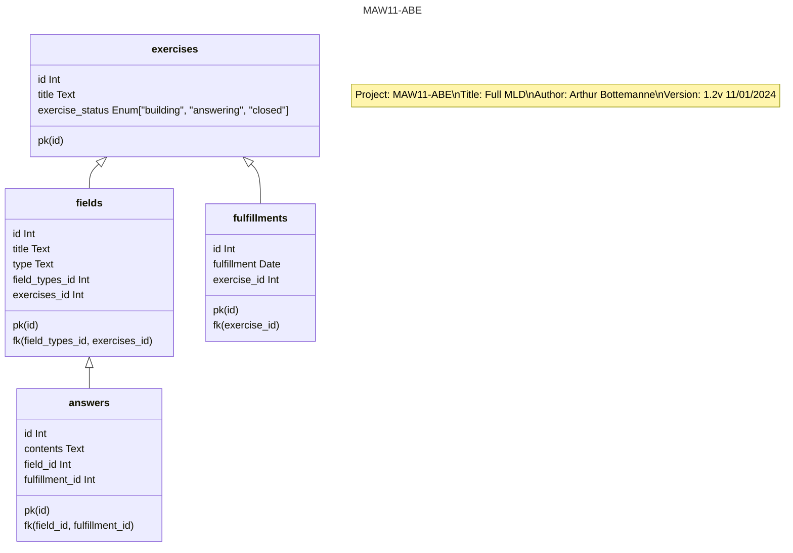

```mermaid
---
title: MAW11-ABE
---
classDiagram
    note "Project: MAW11-ABE\nTitle: Full MLD\nAuthor: Arthur Bottemanne\nVersion: 1.2v 11/01/2024"
    exercises <|-- fields
    fields <|-- answers
    exercises <|-- fulfillments
    class exercises{
        pk(id)
        id Int
        title Text
        exercise_status Enum["building", "answering", "closed"]
    }
    class fields {
        pk(id)
        fk(field_types_id, exercises_id)
        id Int
        title Text
        type Text
        field_types_id Int
        exercises_id Int
    }
    class answers {
        pk(id)
        fk(field_id, fulfillment_id)
        id Int
        contents Text
        field_id Int
        fulfillment_id Int
    }
    class fulfillments {
        pk(id)
        fk(exercise_id)
        id Int
        fulfillment Date
        exercise_id Int
    }
```
